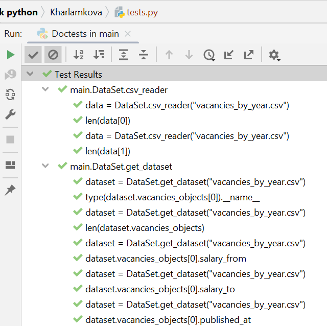

# Задание 2.3.2. Тестирование

# Задание 2.3.3. Профилирование

Первый вариант форматирования даты:

Второй вариант форматирования даты:

Третий вариант форматирования даты:

Оставляем первый вариант.

# Задание 3.2.1

# Задание 3.2.2
С многопроцессорной обработки 

Без многопроцессорной обработки 

# Задание 3.2.3

# Задание 3.3.1
